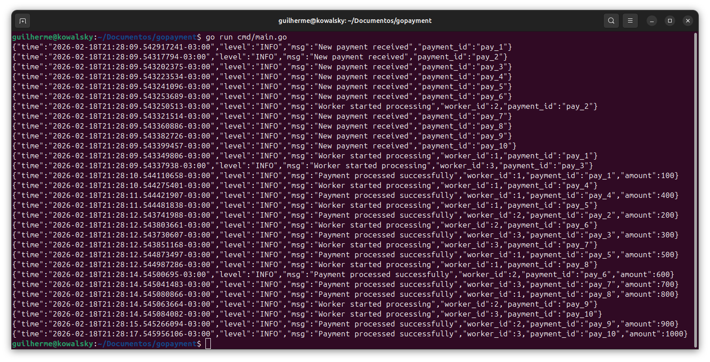

# Go Payment (Worker + Queue + Logger)

Este projeto é um exemplo **extremamente simples** para praticar
conceitos fundamentais de concorrência em Go:

-   Fila com Channels
-   Worker Pool
-   Goroutines
-   Logger estruturado

------------------------------------------------------------------------

# Estrutura do Projeto

    gopayment/
    │
    ├── cmd/
    │   └── main.go
    │
    ├── internal/
    │   ├── logger/
    │   │   └── logger.go
    │   │
    │   ├── payment/
    │   │   └── payment.go
    │   │
    │   ├── queue/
    │   │   └── queue.go
    │   │
    │   └── worker/
    │       └── worker.go
    │
    └── go.mod

------------------------------------------------------------------------

# Diagrama Mental

``` go
                ┌─────────────────┐
                │   HTTP Handler  │
                └────────┬────────┘
                         │
                         ▼
                ┌─────────────────┐
                │   PaymentQueue  │  (chan Payment)
                └────────┬────────┘
                         │
          ┌──────────────┼──────────────┐
          ▼              ▼              ▼
      Worker 1       Worker 2       Worker 3
          │              │              │
          └─────── Process Payment ─────┘
                         │
                         ▼
                      Logger
```

------------------------------------------------------------------------

# Objetivo do Sistema

Simular um processamento assíncrono de pagamentos.

Fluxo:

    Recebe pagamento → Coloca na fila → Workers processam → Logger registra

------------------------------------------------------------------------

# Conceitos Fundamentais

## Channel (Fila)

Em Go, usamos `chan` para criar filas em memória.

``` go
make(chan payment.Payment, 10)
```

-   Buffer 10 → suporta até 10 pagamentos na fila
-   Se lotar, quem envia bloqueia

Isso simula **backpressure real de sistemas distribuídos**.

------------------------------------------------------------------------

## Worker Pool

Criamos múltiplas goroutines consumindo da mesma fila:

``` go
for i := 1; i <= 3; i++ {
    worker.StartWorker(i, paymentQueue.Jobs)
}
```

Cada worker:

``` go
for job := range jobs {
    // Processa pagamento
}
```

Quando vários workers consomem o mesmo channel, temos concorrência real.

------------------------------------------------------------------------

## Logger Estruturado

Usamos `log/slog` (Go 1.21+):

``` go
slog.NewJSONHandler(os.Stdout, nil)
```

Saída:

``` json
{
  "msg": "Payment processed successfully",
  "worker_id": 1,
  "payment_id": "pay_1",
  "amount": 100
}
```

Isso é padrão de produção.

------------------------------------------------------------------------

# Como Executar

## Criar o módulo

Na raiz:

    go mod init gopayment

## Rodar o projeto

Estando na raiz:

    go run ./cmd/main.go


------------------------------------------------------------------------

# O que você verá ao rodar

-   Pagamentos sendo recebidos
-   Workers processando simultaneamente
-   Logs intercalados (prova de concorrência)

Exemplo:

``` json
{"msg":"Worker started processing","worker_id":1,"payment_id":"pay_1"}
{"msg":"Worker started processing","worker_id":2,"payment_id":"pay_2"}
{"msg":"Worker started processing","worker_id":3,"payment_id":"pay_3"}
```



------------------------------------------------------------------------

# Como Funciona Internamente

### main.go

-   Inicializa logger
-   Cria fila
-   Sobe workers
-   Envia pagamentos

------------------------------------------------------------------------

### queue.go

Define a estrutura da fila:

``` go
type PaymentQueue struct {
    Jobs chan payment.Payment
}
```

------------------------------------------------------------------------

### worker.go

Worker infinito:

``` go
for job := range jobs {
    time.Sleep(2 * time.Second)
}
```

Enquanto o canal estiver aberto, ele continua processando.

------------------------------------------------------------------------

### payment.go

Define a entidade:

``` go
type Payment struct {
    ID     string
    Amount float64
    UserID string
}
```

------------------------------------------------------------------------

# Conceitos de Arquitetura

-   `cmd/` → ponto de entrada da aplicação
-   `internal/` → código interno da aplicação
-   Separação por responsabilidade
-   Arquitetura modular

------------------------------------------------------------------------

# Conclusão

Este projeto demonstra:

-   Como funciona uma fila real em Go
-   Como múltiplos workers competem por jobs
-   Como channels são poderosos
-   Como estruturar um projeto Go de forma limpa

------------------------------------------------------------------------

Desenvolvido para prática de concorrência em Go.
